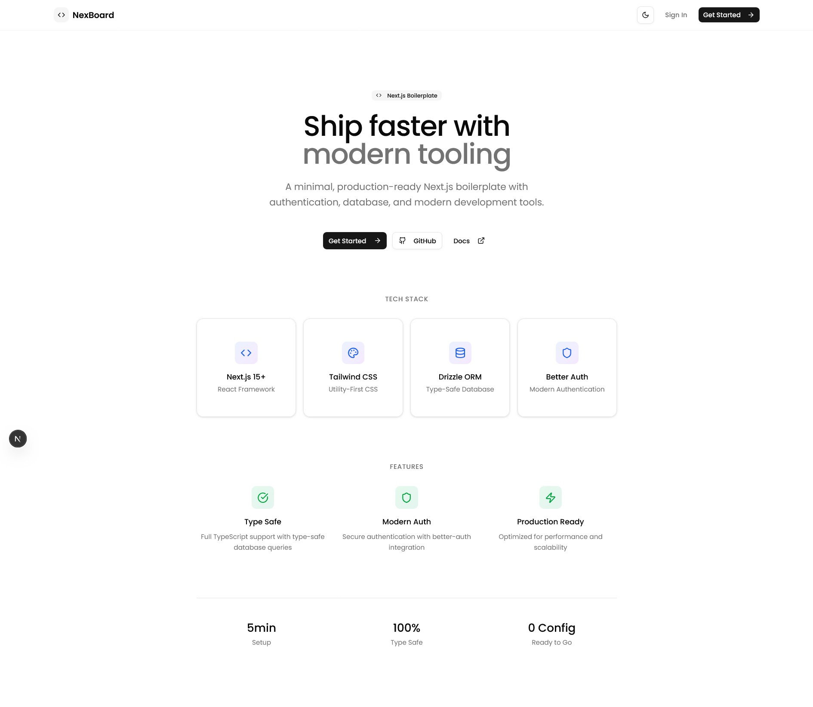

# NexBoard Boilerplate

A modern, minimal, and production-ready dashboard boilerplate built with **Next.js 15**, **shadcn/ui**, **Tailwind CSS 4**, and **lucide-react**.
Perfect for SaaS, admin panels, and internal tools.
Designed for easy customization and rapid development.

---

## ✨ Features

- **Modern UI**: Built with shadcn/ui and Tailwind CSS, using only design tokens and variables.
- **Responsive Sidebar**: Collapsible, mobile-friendly, and easy to customize.
- **Dashboard Blocks**: Stat cards, recent activity, top projects with progress, and team members.
- **Dark/Light Mode**: Seamless theme toggle with persisted preference.
- **Accessible**: Keyboard navigation and screen reader friendly.
- **Componentized**: Easy to extend and maintain.
- **TypeScript**: Full type safety and autocompletion.
- **Radix UI Primitives**: For accessible, unstyled UI building blocks.

---

## 🛠️ Tech Stack

- [Next.js 15](https://nextjs.org/) – App Router, SSR/SSG, file-based routing
- [shadcn/ui](https://ui.shadcn.com/) – Accessible, headless UI components
- [Tailwind CSS 4](https://tailwindcss.com/) – Utility-first CSS framework
- [lucide-react](https://lucide.dev/) – Icon library
- [Radix UI](https://www.radix-ui.com/) – UI primitives (used by shadcn/ui)
- [next-themes](https://github.com/pacocoursey/next-themes) – Theme switching
- [TypeScript](https://www.typescriptlang.org/) – Static typing

---

## 📂 Project Structure

```
tamplet/
├── .next/ # Next.js build output
├── node_modules/
├── public/
│ └── avatars/ # User avatar images
├── src/
│ ├── app/
│ │ ├── auth/
│ │ │ └── page.tsx # Authentication page
│ │ ├── dashboard/
│ │ │ └── page.tsx # Dashboard page
│ │ ├── layout.tsx # App layout (sidebar, theme, etc.)
│ │ └── page.tsx # Root landing page
│ ├── components/ # UI and app components (sidebar, nav, cards, etc.)
│ ├── hooks/ # Custom React hooks
│ ├── lib/ # Utilities and libraries
│ └── globals.css # Tailwind and global styles
├── .gitignore
├── bun.lock
├── components.json
├── next-env.d.ts
├── next.config.ts
├── package.json
├── postcss.config.mjs
├── README.md
├── tailwind.config.js
└── tsconfig.json

```

---

## 🚀 Getting Started

### 1. **Clone the repository**

```bash
git clone https://github.com/Millosaurs/nexboard.git
cd nexboard
```

### 2. **Install dependencies**

```bash
npm install
# or
yarn install
# or
pnpm install
```

### 3. **Run the development server**

```bash
npm run dev
# or
yarn dev
# or
pnpm dev
```

Open [http://localhost:3000](http://localhost:3000) in your browser to see the dashboard.

---

## 🖌️ Customization

### Sidebar & Navigation

- Edit `/src/components/app-sidebar.tsx` and related nav components to add, remove, or reorder sidebar sections.
- Update icons using [lucide-react](https://lucide.dev/).

### Dashboard Content

- Update `/src/app/dashboard/page.tsx` to change stats, activity, projects, or team members.
- Add new dashboard widgets using shadcn/ui `Card`, `Table`, or other components.

### Theming

- Uses [next-themes](https://github.com/pacocoursey/next-themes) and shadcn/ui theme system.
- Customize colors in `tailwind.config.js` and `globals.css`.

### Authentication

- The `/auth` page is a placeholder. Integrate your preferred auth provider (NextAuth.js, Clerk, Auth0, etc.) as needed.

---

## 🧩 Adding New Components

- Use shadcn/ui CLI or copy from [shadcn/ui docs](https://ui.shadcn.com/docs/components).
- Place new components in `/src/components/ui/` or `/src/components/` as appropriate.
- Use Tailwind utility classes and variables for consistent styling.

---

## 🧑‍💻 For Developers

- **TypeScript**: All components and pages are typed.
- **ESLint**: Run `npm run lint` to check code quality.
- **Prettier**: Use your editor’s format-on-save for consistent code style.
- **Bun**: If you use Bun, a `bun.lock` is included, but npm/yarn/pnpm are fully supported.

---

## 📸 Preview

> Add a screenshot of your dashboard UI here for a better first impression!
>
> Example:
> 

---

## 🤝 Contributing

1. Fork this repository
2. Create your feature branch (`git checkout -b feature/YourFeature`)
3. Commit your changes (`git commit -m 'Add some feature'`)
4. Push to the branch (`git push origin feature/YourFeature`)
5. Open a Pull Request

---

## 📄 License

MIT License

```
MIT License

Copyright (c) 2024 Shrivatsav

Permission is hereby granted, free of charge, to any person obtaining a copy
of this software and associated documentation files (the "Software"), to deal
in the Software without restriction, including without limitation the rights
to use, copy, modify, merge, publish, distribute, sublicense, and/or sell
copies of the Software, and to permit persons to whom the Software is
furnished to do so, subject to the following conditions:

The above copyright notice and this permission notice shall be included in all
copies or substantial portions of the Software.

THE SOFTWARE IS PROVIDED "AS IS", WITHOUT WARRANTY OF ANY KIND, EXPRESS OR
IMPLIED, INCLUDING BUT NOT LIMITED TO THE WARRANTIES OF MERCHANTABILITY,
FITNESS FOR A PARTICULAR PURPOSE AND NONINFRINGEMENT. IN NO EVENT SHALL THE
AUTHORS OR COPYRIGHT HOLDERS BE LIABLE FOR ANY CLAIM, DAMAGES OR OTHER
LIABILITY, WHETHER IN AN ACTION OF CONTRACT, TORT OR OTHERWISE, ARISING FROM,
OUT OF OR IN CONNECTION WITH THE SOFTWARE OR THE USE OR OTHER DEALINGS IN THE
SOFTWARE.
```

---

> Built with ❤️ using [shadcn/ui](https://ui.shadcn.com/) and [Next.js](https://nextjs.org/).
> Built by [Millosaurs](https://shrivatsav.dev)

```


